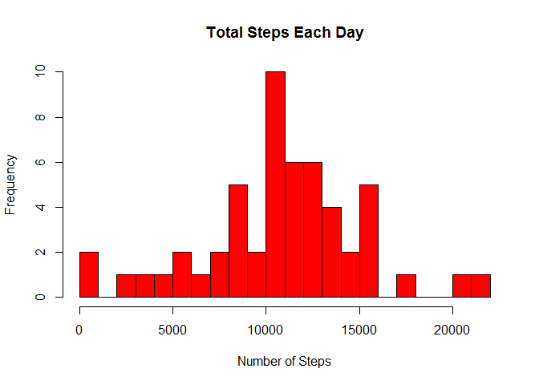
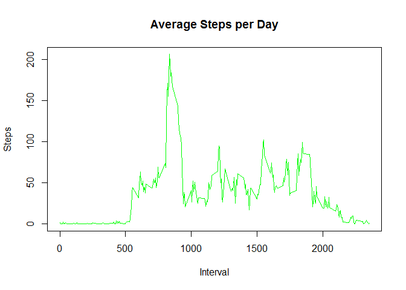
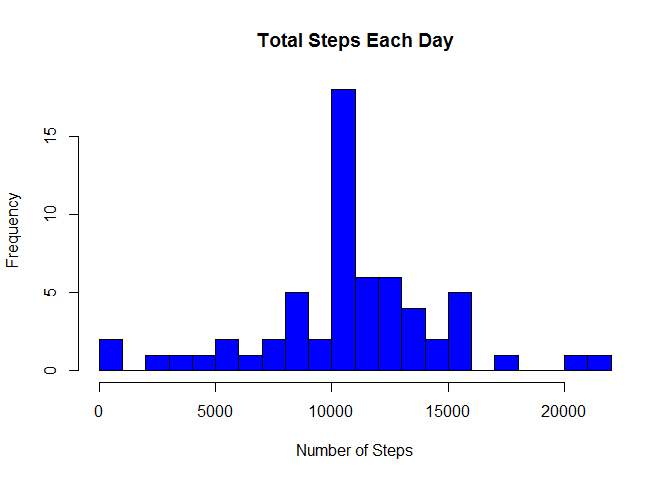
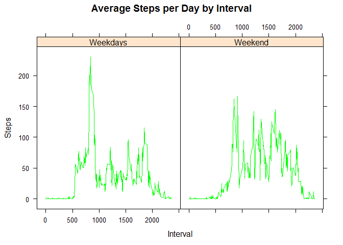

# PA1_template
Biscuit7  
`r format(Sys.Date())`  


Analyzing Step Data from an Activity Monitoring Device
======================================================

This project is part of the Reproducible Research course in Coursera's Data Science specialisation track. The purpose of the project is to analyse data collected from a FitBit by way of:

* loading and preprocessing data
* drawing time series plots and histograms
* imputing missing values
* interpreting data to answer research questions

## Loading and preprocessing the data
###Read activity data and remove missing values

```r
df <- read.csv("activity.csv",header=T,na.strings = "NA")
df1 <- df[!is.na(df$steps),]
```

## What is mean total number of steps taken per day?
### Histogram 

```r
total <- aggregate(steps ~ date, df1, sum)
hist(total$steps, breaks=20, main="Total Steps Each Day", col="red", xlab="Number of Steps")
```

<!-- -->

### Mean and median of the total number of steps taken per day

```r
step_mean <- round(mean(total$steps),2)
step_median <- median(total$steps)
```
The `mean` is 1.076619\times 10^{4} and the `median` is 10765.

## What is the average daily activity pattern?
### Time series of the average steps per day

```r
avg_steps <- aggregate(steps ~ interval, df1, mean)
avg_steps$day <- seq.int(nrow(avg_steps))
plot(avg_steps$interval, avg_steps$steps, type="l", main="Average Steps per Day", col="green", 
     xlab="Interval", ylab="Steps")
```

<!-- -->

### The 5-minute interval with the maximum number of steps, on average

```r
avg_int <- aggregate(steps ~ interval, df1, mean)
max_int <- avg_int[avg_int$steps==max(avg_int$steps),"interval"]
```
The `interval` with the maximum number of steps, on average, is 835.

## Imputing missing values
### Number of records with missing values

```r
sum(is.na(df))
```

```
## [1] 2304
```
There are 2304 `missing values`.

### Imputing
Imputation will involve filling in the missing values with the mean number of steps per interval, which is assigned to `avg_int`.


```r
df_new <- df
avg  <- tapply(df_new$steps, df_new$interval, mean, na.rm=T, simplify=T)
df_new$steps[is.na(df_new$steps)] <- avg[as.character(df_new$interval[is.na(df_new$steps)])]
```

### Histogram with imputed values

```r
total_new <- aggregate(steps ~ date, df_new, sum)
hist(total_new$steps, breaks=20, main="Total Steps Each Day", col="blue", xlab="Number of Steps")
```

<!-- -->

### Mean and median of the total number of steps taken per day, with imputed values

```r
new_mean <- round(mean(total_new$steps),2)
new_median <- median(total_new$steps)
```
The `new mean` is 1.076619\times 10^{4} and the `new median` is 1.0766189\times 10^{4}.

## Are there differences in activity patterns between weekdays and weekends?
### Panel plot comparing weekdays and weekends

```r
weekend <- c("Saturday", "Sunday")
df_new$day = as.factor(ifelse(is.element(weekdays(as.Date(df_new$date)),weekend), "Weekend", "Weekdays"))
total_day <- aggregate(steps ~ interval + day, df_new, mean)
xyplot(total_day$steps ~ total_day$interval|total_day$day, col="green", main="Average Steps per Day by Interval", xlab="Interval", ylab="Steps",layout=c(2,1), type="l")
```

<!-- -->
